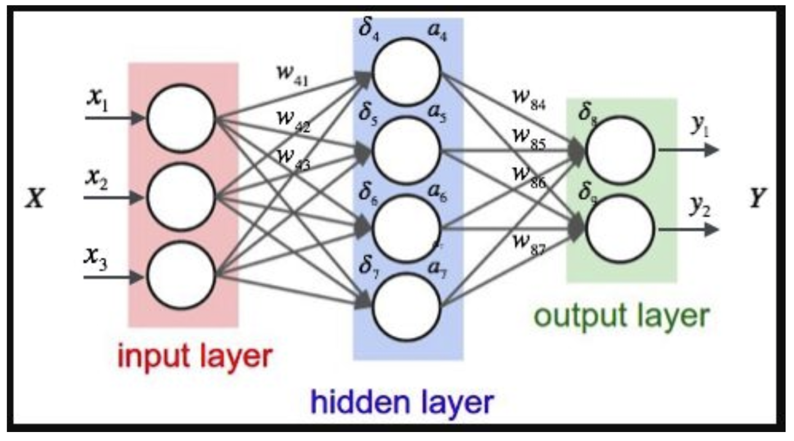

# Introduction to Deep Learning
Python, Keras, Tenserflow, AWES. Guided by [Chyld Medford](https://github.com/chyld/intro-deep-learning).

## Machine Learning

### Models
* Linear regression - plot a bunch of stuff, computer draws line
* Decision tree - binary decisions, etc.
* Random forest - a whole bunch of trees
* and more

### Supervised vs. Unsupervised
* Supervised: You know the answer and can provide feedback on whether computer is right or wrong, e.g. 3 + 3 = ?
* Unsupervised: You don't know the answer, must get insights from datapoints and look for patterns
* Deep learning is supervised

### Theory of Deep Learning

* Input layer > hidden layer > output layer

**Input layer**
* Dense input layer for images: takes each pixel in an image, makes it one giant line as a single input, outputs to hidden layer * weight
* Inputs can be anything represented by a number, so basically everything, but important to rescale large numbers
* "Nodes" in chart are called "perceptrons" (neurons)

**Hidden layer**
* Hidden layer sums inputs, activation function makes non-linear output
* Bigger layer, longer processing times

**Output layer**
* Summed again * weight at output layer
* Potential outputs can be linear, sigmoid, softmax
* Use sigmoid for Not Hotdog

## Types of Neural Networks
* Dense / Fully connected / Multilayer perception
* Convolutional Neural Network (CNN) - use this for images
* Recurrent Neural Networks (RNN) - audio, text, video, when time matters
* Generative adversarial networks (GAN) - generate data, e.g. making a face (trippy!)
* and more

## Keras & Tensorflow
* Tensorflow is software for creating neural networks.
* Keras is good for simpler problems, works on top of Tensorflow.
* `pip install tensorflow` `pip install keras` `pip install numpy`

### Generating the model (dense)
```python
# create model
model = Sequential()

# 28 x 28 = 784, make pixels one line
model.add(Flatten(input_shape = input_shape))
model.add(Dense(128, activation='relu'))  

# remove neurons from the network (in this case, 20%)
# to help "generalize" the data
# should be between 0.2 and 0.5
model.add(Dropout(0.2))                      
model.add(Dense(64, activation='relu'))      
model.add(Dropout(0.2))     

# in this case, 10 possible outputs,
# softmax gives probabilities for each                 
model.add(Dense(10, activation='softmax'))   

model.summary()
```

```
# OUTPUT
_________________________________________________________________
Layer (type)                 Output Shape              Param #   
=================================================================
flatten_1 (Flatten)          (None, 784)               0         
_________________________________________________________________
dense_1 (Dense)              (None, 128)               100480    
_________________________________________________________________
dropout_1 (Dropout)          (None, 128)               0         
_________________________________________________________________
dense_2 (Dense)              (None, 64)                8256      
_________________________________________________________________
dropout_2 (Dropout)          (None, 64)                0         
_________________________________________________________________
dense_3 (Dense)              (None, 10)                650       
=================================================================
Total params: 109,386
Trainable params: 109,386
Non-trainable params: 0
```

### Compiling a model
```python
model.compile(loss='categorical_crossentropy', optimizer='rmsprop', metrics=['accuracy'])
# verbosity 0, 2, 1
# epoch = go through all the data once
hist = model.fit(x_train_final, y_train_final, batch_size=32, epochs=3,
          validation_data=(x_validation_final, y_validation_final), verbose=1, shuffle=True)
```

## CNNs

* Maintains spatial relationships
* [`cnn-fashion-example.py`](deep-learning-intro/cnn-fashion-example.py)

### Generating the model (CNN)
```python
model1 = Sequential()

# Conv2D = two dimensional convolution
# 32 3x3 filters (5x5 also okay)
model1.add(Conv2D(filters=32, kernel_size=3, padding='valid', activation='relu', input_shape=input_shape))

# output of the following is 50% smaller
model1.add(MaxPooling2D(pool_size=2))

model1.add(Conv2D(filters=64, kernel_size=3, padding='valid', activation='relu'))
model1.add(MaxPooling2D(pool_size=2))

# flattens convolutional ouput
model1.add(Flatten())

# feed into a dense layer
model1.add(Dense(128, activation='relu'))
model1.add(Dropout(0.2))
model1.add(Dense(10, activation='softmax'))

model1.summary()
```
```markdown
# OUTPUT

_________________________________________________________________
Layer (type)                 Output Shape              Param #   
=================================================================
conv2d_3 (Conv2D)            (None, 26, 26, 32)        320       
_________________________________________________________________
max_pooling2d_3 (MaxPooling2 (None, 13, 13, 32)        0         
_________________________________________________________________
conv2d_4 (Conv2D)            (None, 11, 11, 64)        18496     
_________________________________________________________________
max_pooling2d_4 (MaxPooling2 (None, 5, 5, 64)          0         
_________________________________________________________________
flatten_2 (Flatten)          (None, 1600)              0         
_________________________________________________________________
dense_3 (Dense)              (None, 128)               204928    
_________________________________________________________________
dropout_2 (Dropout)          (None, 128)               0         
_________________________________________________________________
dense_4 (Dense)              (None, 10)                1290      
=================================================================
Total params: 225,034
Trainable params: 225,034
Non-trainable params: 0
```

## Miscellaneous
*
